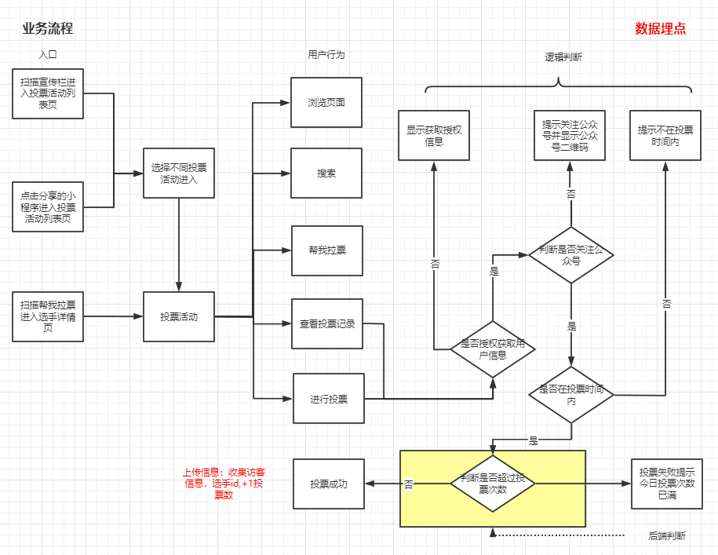
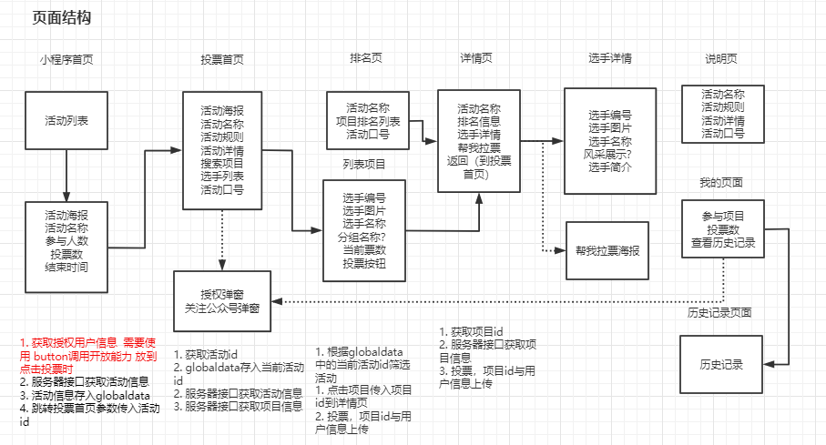
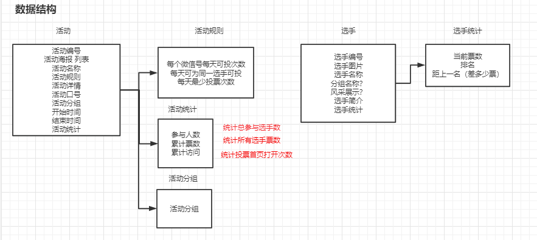

## 投票小程序设计文档

Author: steven Date: 2020-09-11 Version：0.0.1

#### 一、需求分析



问题：

1. 怎么判断是否关注公众号？
- [x] T1: 注册小程序
- [x] T2: 公众号中关联小程序
- [x] T3: 注册微信开放平台账号，使用unionID机制统计公众号与小程序帐号  
2. 授权获取信息与关注公众号怎么显示？
-[x] T1: 点击投票或者我的页面登录时判断是否授权并是否关注公众号
3. 生成二维码的信息从哪儿获取？
- [x] T1：后端调用
- [x] T2: 扫码进入指定页面 开发测试
        
  
      小程序管理->开发->开发设置->启用扫普通链接二维码打开小程序

#### 二、页面结构



#### 三、数据结构



选手：

```typescript
export interface Iitem {
  id: number // 选手编号
  name: string // 选手名称
  img: string // 选手图片
  company?: string // 选手公司
  group?: string // 选手分组
  show?:string // 选手风采
  description: string // 选手简介
  stats: Iinfo[] // 统计信息
}
```

活动:

```typescript
export interface Iactivity {
  id: number // 活动编号
  name: string //活动名称
  bannerImg: string[] //广告图片
  startTime: string //开始时间
  endTime: string //结束时间
  rule: Iinfo[] // 活动规则
  desc: string //活动描述
  status:'ONGOING'|'ENDED'|'ISCOMING' // 活动状态
  stats: Iinfo[] // 统计信息
}
```

信息项：

```typescript
// 属性
export interface Iinfo {
  name: string // 属性名称
  value: number // 属性值
}
```

投票规则:

```typescript
export const rule: Array<Iinfo> = [
  {
    name: "每个微信号每天可以投",
    value: 3,
  },
  {
    name: "每天可为同一选手投",
    value: 1,
  },
  {
    name: "每天最少投票",
    value: 1,
  },
]
```

活动统计：

```typescript
export const activityStats: Array<Iinfo> = [
  {
    name: "参与人数",
    value: 0,
  },
  {
    name: "累计票数",
    value: 0,
  },
  {
    name: "累计访问",
    value: 0,
  },
]
```

选手统计:

```typescript
export const itemStats: Array<Iinfo> = [
  {
    name: "当前票数",
    value: 0,
  },
  {
    name: "排名",
    value: 0,
  },
  {
    name: "距上一名",
    value: 0,
  },
]
```

#### 四、接口方案

##### 传输方式

HTTPS 传输 端口443
Method：GET，POST
Content-Type：application/json
Encoding：UTF-8

##### 接口概述

| 类型     | 方式   | 接口名称 | 接口地址    | 说明                |
| -------- | ------ | -------- | ----------- | ------------------- |
| 后台接口 | 被调用 | 活动信息 | /activities | 此URL供获取活动信息 |
| 后台接口 | 被调用 | 项目信息 | /items      | 此URL供获取项目信息 |
| 后台接口 | 被调用 | 投交投票 | /vote       | 此URL供增加投票数   |

活动信息接口：

```bash
GET /activities

?order=asc // 结束时间顺序, asc, desc， 默认desc 
&status=all // 活动状态 all, ongoing, ended, iscoming, 默认all
&limit=20 // 分页数量
&offset=20 // 分页距离
&page=1 //当前页面

GET /activities/<id>
```

项目信息接口:

```bash
GET /items

?activity=0 // 活动编号，
order=asc // 票数顺序, asc, desc， 默认desc 
&group=all // 项目分组, 默认全部，可添加
&limit=20 // 分页数量
&offset=20 // 分页距离
&page=1 // 当前页面

GET /items/<id>
```

增加票数接口：

```bash
POST /items/<id>

data:{
	userinfo, // 通过授权获取到的用户信息
}
```


