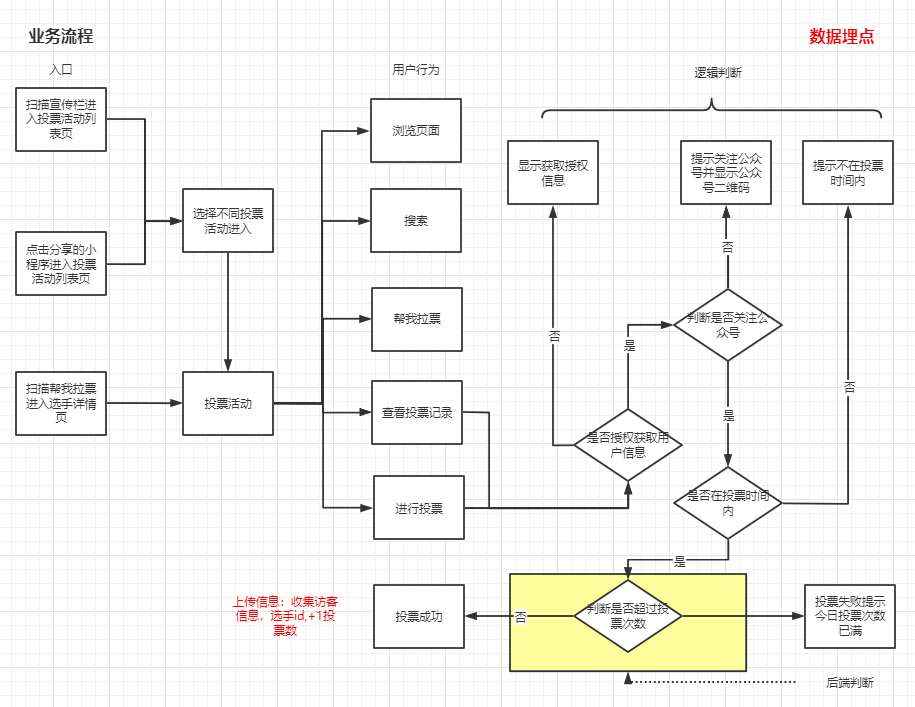
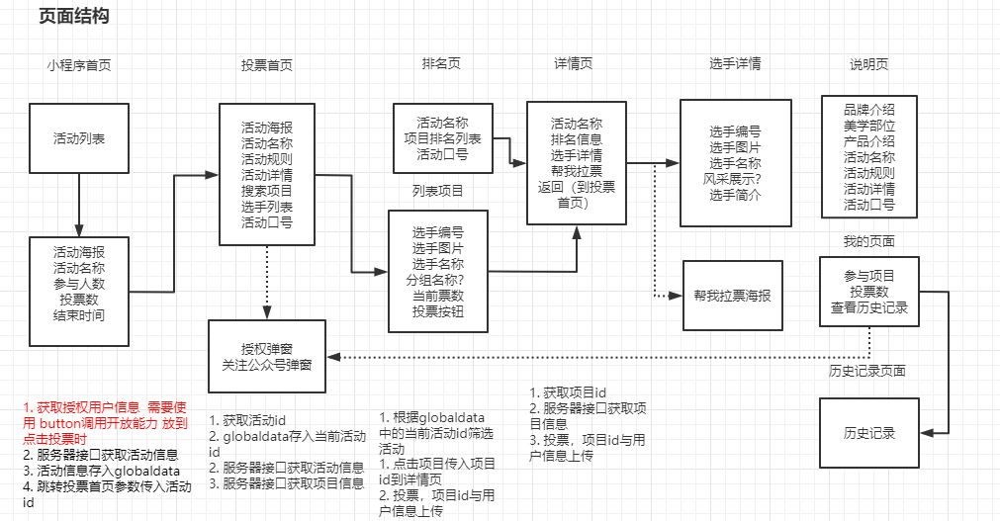
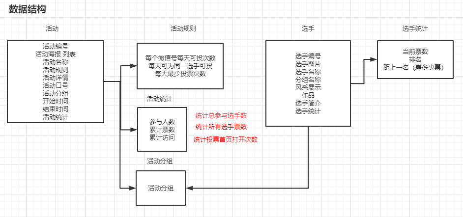

## 投票小程序设计文档

Author: steven Date: 2020-09-11 Version：0.0.1

#### 一、需求分析



用户通过搜索小程序，扫码或者点击别人分享的小程序进入程序，可以在活动列表页查看所有活动，可以在我的页面登录查看历史投票记录。在活动列表页点击活动进入具体活动，可以在投票页查看活动当前信息，包含前10选手，活动名称，活动规则，活动详情，选手列表，可以在投票页面进行搜索，下拉刷新更多选手和选择不同区域查看选手。可以点击tabbar进入活动详情页查看活动详情，活动详情页包括品牌介绍，美学部位介绍，产品介绍，活动信息，可以点击tabbar进入当前活动排名页查看选手排名，可以点击不同区域查看不同区域下选手排名。

问题：

1. 怎么判断是否关注公众号？
- [x] T1: 注册小程序
- [x] T2: 公众号中关联小程序
- [x] T3: 注册微信开放平台账号，使用unionID机制统计公众号与小程序帐号  
2. 授权获取信息与关注公众号怎么显示？
- [x] T1: 点击投票或者我的页面登录时判断是否授权并是否关注公众号
3. 生成二维码的信息从哪儿获取？
- [x] T1：后端调用
- [x] T2: 扫码进入指定页面 开发测试
      
  
      小程序管理->开发->开发设置->启用扫普通链接二维码打开小程序

#### 二、页面结构



##### 功能点

1. 首页
   - 下载活动信息


#### 三、数据结构



选手：

```typescript
// 选手返回接口
export interface ItemResponse {
    pageNo: number //页码
    pageSize: number //每页大小
    data: Iitem[] //选手内容
    totalCount: number //总数据量
}
// 选手内容接口
export interface Iitem {
    category: Category
    id: number
    code: string
    name: string
    description: string
    company: string
    img: string
    feature: string
    play: string
    activityId: number
    stats: Stat[]
}
```

类目：

```typescript
export interface Category {
    id: number
    pid: number
    name: string
    description: string
    activityId: number
    createBy: string
    createTime: string
    updateBy: string
    updateTime: string
}
```

活动:

```typescript
export interface ActivityResponse {
    pageNo: number
    pageSize: number
    data: Iactivity[]
    totalCount: number
}
// 活动内容
export interface Iactivity {
    id: number
    name: string
    theme: string
    description: string
    startTime: string
    endTime: string
    status: string
    bannerImg: string[]
    rule: Iinfo[]
    statistics: Iinfo[]
}
```

信息项：

```typescript
// 属性
export interface Iinfo {
  name: string // 属性名称
  value: number // 属性值
}
```

用户信息：

```typescript
// 用户信息返回接口
export interface UserInfoResponse {
    id: number
    mobile: string
    unionId: string
    openId: string
    nickName: string
    gender: string
    language: string
    city: string
    province: string
    country: string
    avatarUrl: string
    createTime: string
    updateTime: string
}
```

微信登录：

```typescript
// 微信登录返回接口
export interface LoginResponse {
    token: string
    openId: string
    unionId: string
}
```


#### 四、接口方案

##### 项目域名

项目根域名：https://tp.huadongbio.com:8095

项目后端文档：[https://tp.huadongbio.com:8095/swagger-ui/index.html?conf...-docs/swagger-config](https://tp.huadongbio.com:8095/swagger-ui/index.html?configUrl=/v3/api-docs/swagger-config)

##### 传输方式

HTTPS 传输 端口443
Method：GET，POST
Content-Type：application/json
Encoding：UTF-8

##### 接口概述

| 类型     | 方式   | 接口名称         | 接口地址             | 说明                            |
| -------- | ------ | ---------------- | -------------------- | ------------------------------- |
| 后台接口 | 被调用 | 活动信息         | /weixin/activity     | 此URL供获取活动信息             |
| 后台接口 | 被调用 | 项目信息         | /weixin/item         | 此URL供获取项目信息             |
| 后台接口 | 被调用 | 投交投票         | /weixin/vote         | 此URL供增加投票数               |
| 后台接口 | 被调用 | 历史投票数据     | /weixin/vote/history | 此URL供查询历史投票数据         |
| 后台接口 | 被调用 | 用户投票统计数据 | /weixin/vote/stat    | 此URL供获取用户投票统计数据     |
| 后台接口 | 被调用 | 用户信息         | /weixin/user         | 此URL供获取解析加密用户信息     |
| 后台接口 | 被调用 | 微信登录         | /weixin/login        | 此URL供获取微信鉴权用户惟一信息 |
| 后台接口 | 被调用 | 分享海报         | /weixin/share/url    | 此URL供获取分享海               |


活动信息接口：

```bash
GET /weixin/activity

?pageNo=1 //当前页面
&pageSize=10 //分页数量
```

项目信息接口:

```bash
GET /weixin/item

?activityId=0 // 活动主键
&categoryId=0 //分类编号
&name='选手名' //选手名称
&code='001' //选手编号
&id=1 //选手主键
&pageNo=1 //当前页面
&pageSize=10 //分页数量
```

增加票数接口：

```bash
POST /weixin/vote

data: {
	1 // 活动主键
}
```

  历史投票数据接口:

```bash
GET /weixin/vote/history

?activityId=1 //活动主键
&startDate='2020-10-01' //开始日期
&endDate='202-10-15' //结束日期
&pageNo=1 //页码
&pageSize=10 //分页数量
```

用户投票统计数据接口：

```bash
GET /weixin/vote/stat
```

用户信息接口：

```bash
GET /weinxin/user

?signature='' //使用 sha1( rawData + sessionkey ) 得到字符串，用于校验用户信息
&encryptedData='' //包括敏感数据在内的完整用户信息的加密数据
&iv='' //加密算法的初始向量
```

微信登录接口:

```bash
POST /weixin/login
data:{
	code //小程序code
}
```

分享海报接口:

```bash
POST /weixin/share/url
```

#### 五、技术选型

采用uniapp+ts+vuex进行项目小程序的编写，uniapp基本vue做的封装，编写方式更友好，更便于日后做多端开发，ts(typescript)是js的超集，具体静态类型，便于提示以及减少bug，vuex利于状态管理。本项目中状态管理会用多种方法，主要是vuex和globaldata这两种方式。

#### 六、小程序注册


